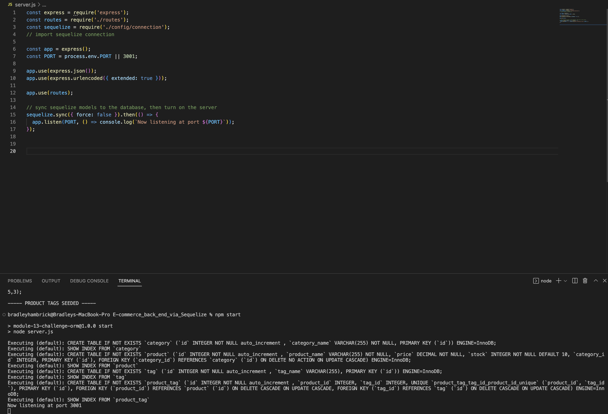
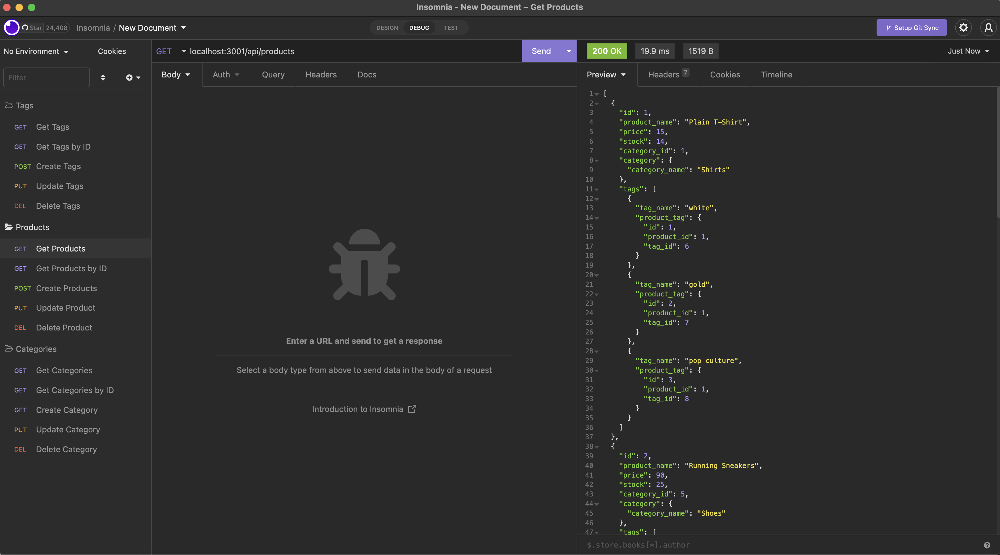
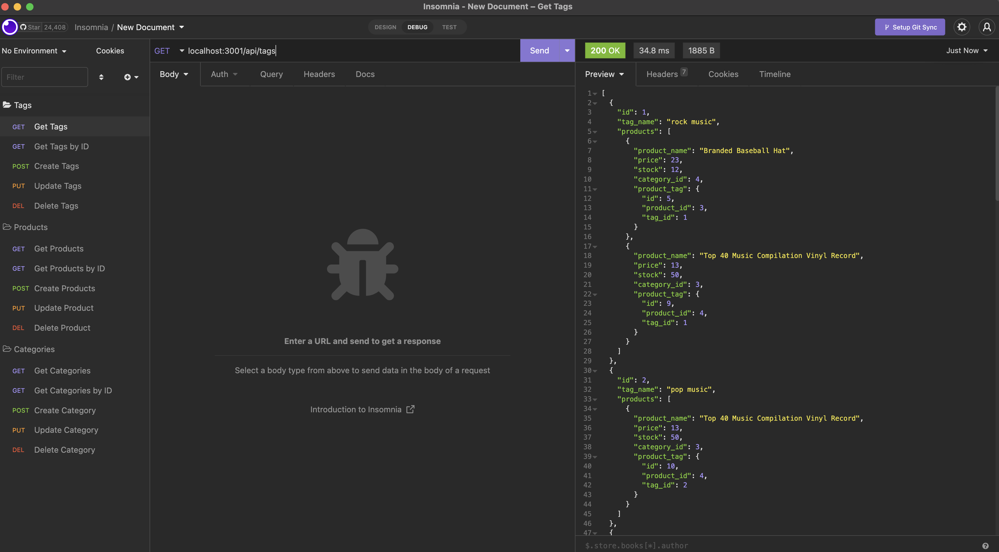
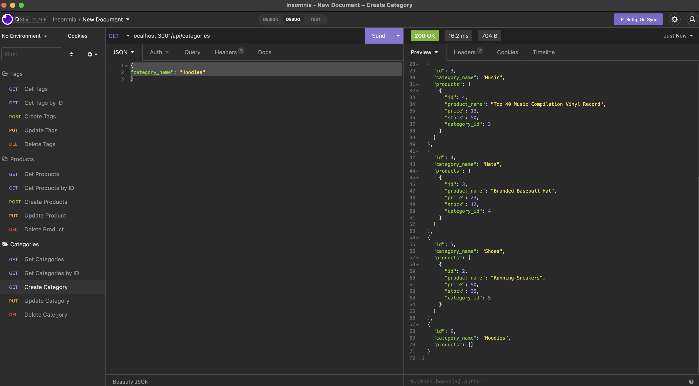

# E-commerce_back_end_via_Sequelize
This project was completed in order to showcase my ability to refactor a back end application that utilizes sequelize in order to interact with the MySql2 database.

## GitHub Repository
[E-commerce_back_end_via_Sequelize](https://github.com/Brad-Hambrick/E-commerce_back_end_via_Sequelize)

##  Walk-through Video
[E-commerce_back_end_via_Sequelize walk through video](https://drive.google.com/file/d/152EKPC8RrwRQU5qgQQXAtYwNxH7o4iEE/view?usp=share_link)

## Description
This project was completed in order to showcase my knowledge of working with back end programming.  This project was refactored using MySql2, Sequelize, and dotenv.

The assigment desctiption is as follows: 

Internet retail, also known as e-commerce, is the largest sector of the electronics industry, having generated an estimated US$29 trillion in 2017 (Source: United Nations Conference on Trade and Development). E-commerce platforms like Shopify and WooCommerce provide a suite of services to businesses of all sizes. Due to the prevalence of these platforms, developers should understand the fundamental architecture of e-commerce sites.

Your challenge is to build the back end for an e-commerce site. You’ll take a working Express.js API and configure it to use Sequelize to interact with a MySQL database.

## Badges
MySql by Oracle.

All of the coding methods in this project were those that were learned during the Vanderbilt Coding Bootcamp as well as some open source searches on mysql and sequelize.  

## Visuals

## Usage
This project was created to showcase my ability refactor back end programming by creating routes in which data is searched for, updated, and deleted. 

To Begin run: 

npm i,
node seeds/index.js,
npm start

## Support
For support, contact Brad Hambrick @bradleyhambrick@gmail.com

## Roadmap
This project is built to a point of basic functionality.   

## Contributing
This project is open to recommendations and future contributions.

## Authors and acknowledgment
Thanks to Vanderbilt Coding Bootcamp for contributing to the knowledge required to build this project.

## License
In this project mysql is used to manage the data and Sequelize to interact with the database.     

## Project status
The project is complete to the point of functionality.